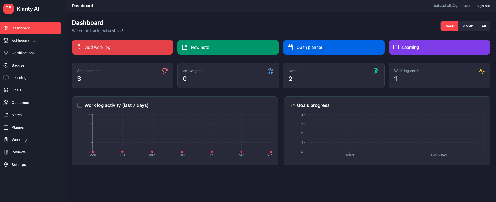

# Klarity AI

Personal work ledger: track your work, daily planner, work log, notes, achievements, and manager review summaries (weekly / monthly / quarterly / annual).



## Features

- **Dashboard** — Overview with action buttons (Add work log, New note, Open planner, Learning), summary cards (achievements, goals, notes, work log), and charts (work log activity, goals progress). Period selector (Week / Month / All).
- **Auth** — Sign up, sign in, sign out; protected routes; profile creation via trigger; service-unavailable handling when Supabase is unreachable.
- **Achievements** — List, detail view, and edit/delete for certifications, badges, and custom milestones.
- **Certifications & Badges** — Catalog views with mark-as-earned; seed `certification_catalog` and `badge_catalog` in Supabase.
- **Learning** — Learning progress table with edit/delete and progress percentage.
- **Goals** — Goals table with status (active/completed/cancelled), edit/delete, target dates.
- **Customers** — Customer list with add/edit/delete.
- **Notes** — List, new note (with voice recording & AI refine), detail view with edit, customer linking.
- **Planner** — Daily plan for today; save/clear; plan items and notes.
- **Work log** — Add, edit, delete entries (date, summary, optional minutes); list with DataGrid.
- **Reviews** — Manager review with period selector (Weekly / Monthly / Quarterly / Annual); shows plans + work log for the range.
- **Settings** — Profile/settings page.
- **APIs** — `/api/planner`, `/api/work-logs`, `/api/transcribe`, `/api/ai`, `/api/search`.

## Tech Stack

| Layer | Technology |
|-------|------------|
| **Framework** | [Next.js 14](https://nextjs.org/) (App Router) |
| **UI** | [React 18](https://react.dev/) |
| **Language** | [TypeScript](https://www.typescriptlang.org/) |
| **Styling** | [Tailwind CSS](https://tailwindcss.com/) |
| **Icons & Charts** | [Lucide React](https://lucide.dev/), [Recharts](https://recharts.org/) |
| **Backend / DB** | [Supabase](https://supabase.com/) (PostgreSQL, Auth) |
| **API** | Next.js Route Handlers (`app/api/*`) |
| **Package manager** | npm |

## Setup

1. **Install dependencies**
   ```bash
   npm install
   ```

2. **Supabase**
   - Create a project at [supabase.com](https://supabase.com).
   - In Dashboard → Project Settings → API, copy **Project URL** and **anon** (or publishable) key.
   - Create `.env.local` with:
     ```
     NEXT_PUBLIC_SUPABASE_URL=https://your-project.supabase.co
     NEXT_PUBLIC_SUPABASE_ANON_KEY=your-anon-key
     ```
   - In Supabase SQL Editor, run the full script in **`supabase/schema.sql`** (tables, indexes, RLS, profile trigger).

3. **Run the app**
   ```bash
   npm run dev
   ```
   Open [http://localhost:3000](http://localhost:3000). Sign up at `/signup`, then sign in at `/login`.

   For a clean restart (kills ports 3000–3005 and starts dev):
   ```bash
   npm run dev:restart
   ```

## UI & Design

- **Dark theme** — HealthApp-style layout: dark sidebar (`#1a202c`), main background (`#1a1b2c`), cards (`#282a3a`), red accent (`#ef4444`).
- **Sidebar** — Icons for each nav item; red pill active state; collapsible-friendly.
- **Shared components** — DataGrid, Modal, ActionButtons for consistent tables and dialogs across the app.
- **Error handling** — Root error, global error, and dashboard error boundaries; inline styles for reliability when CSS fails to load.

## Documentation

- **ARCHITECTURE.md** — Code structure and directory layout
- **CONTROL-FLOW.md** — Data flow and control flow diagrams
- **API-TESTING-SUMMARY.md** — Backend API documentation
- **UI-IMPROVEMENTS-SUMMARY.md** — UI component improvements
- **PLAN.md** — Full scope and roadmap
- **REQUIREMENTS.md** — Functional and non-functional requirements
